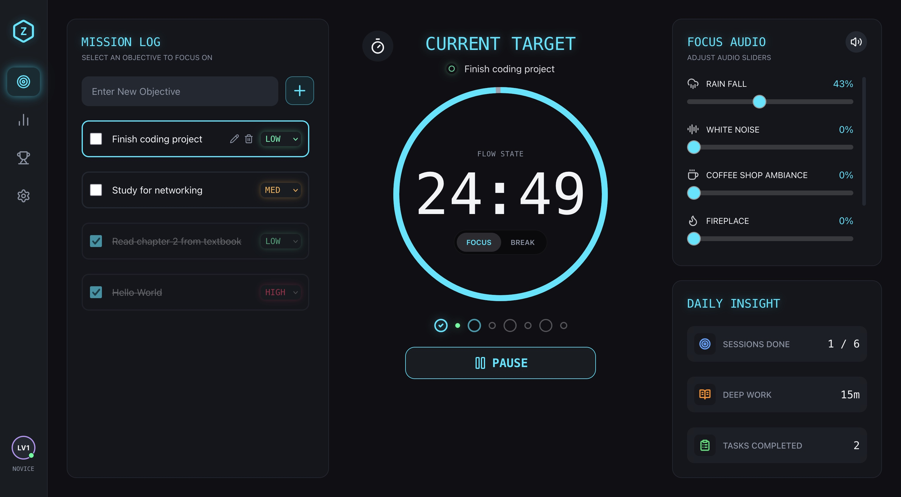
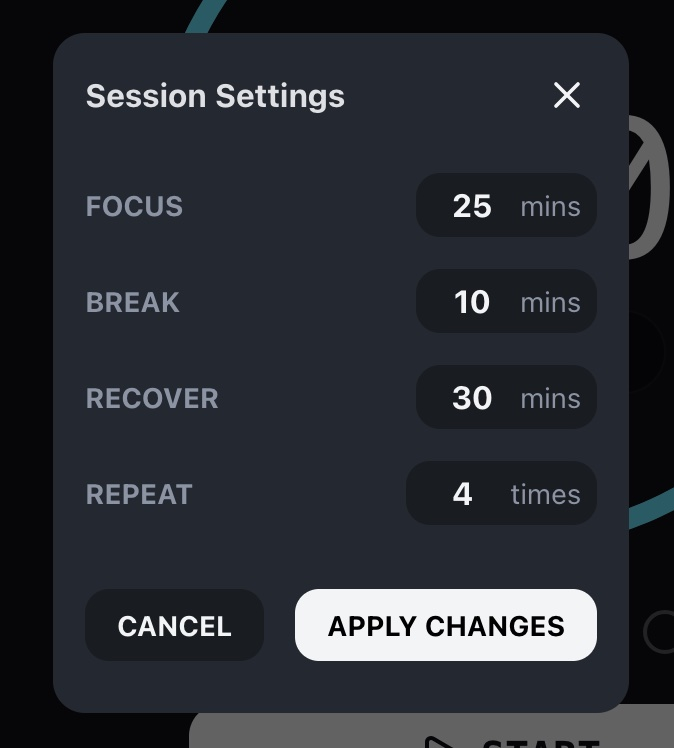
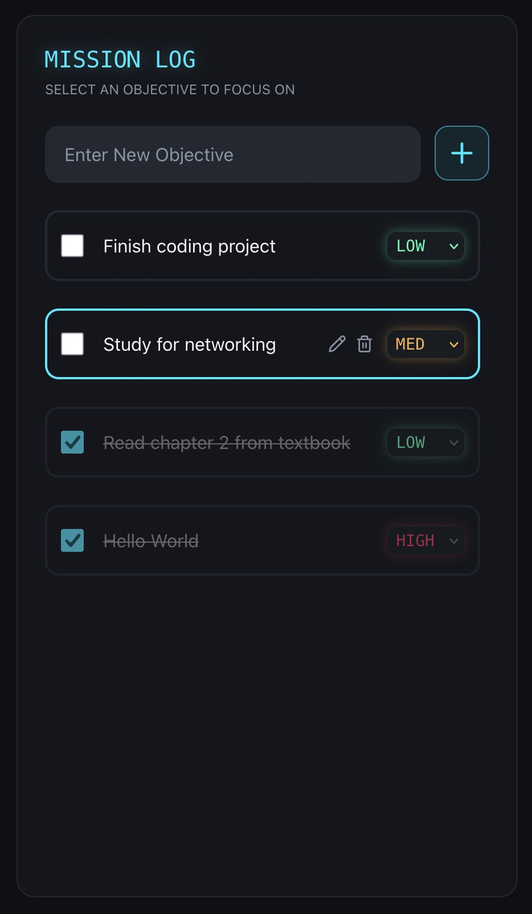
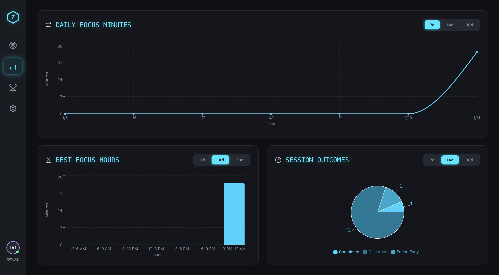
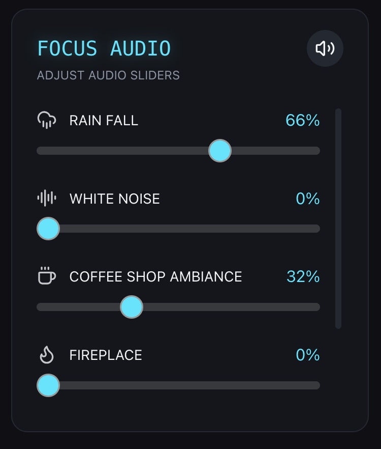
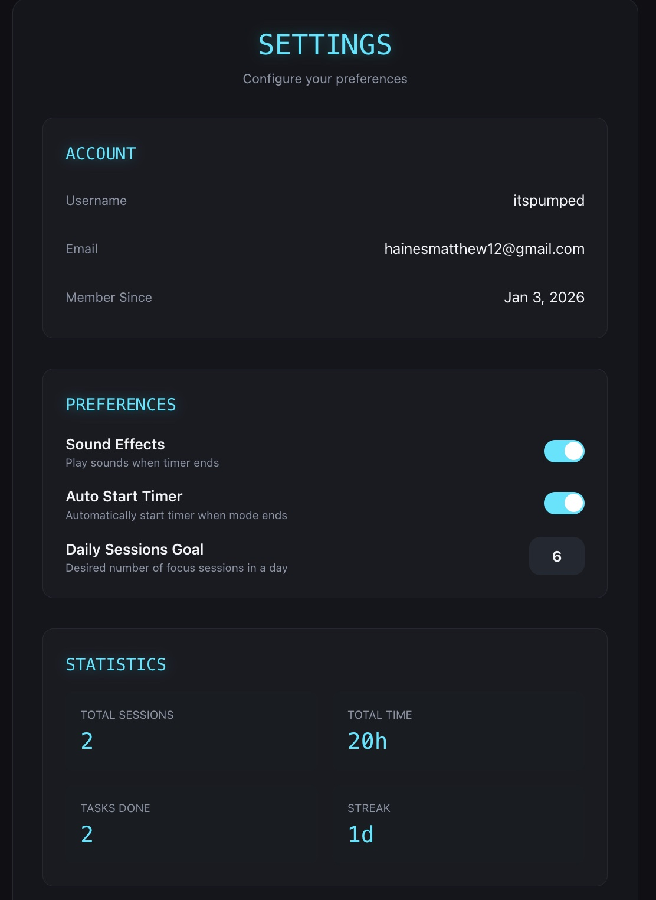
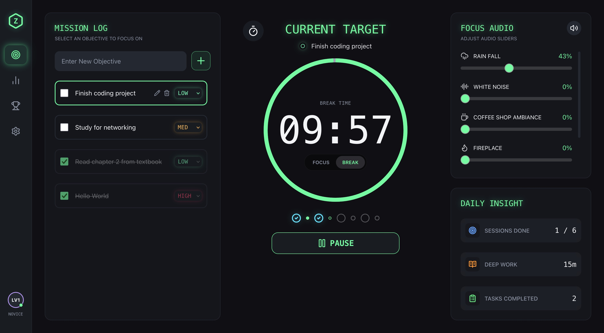
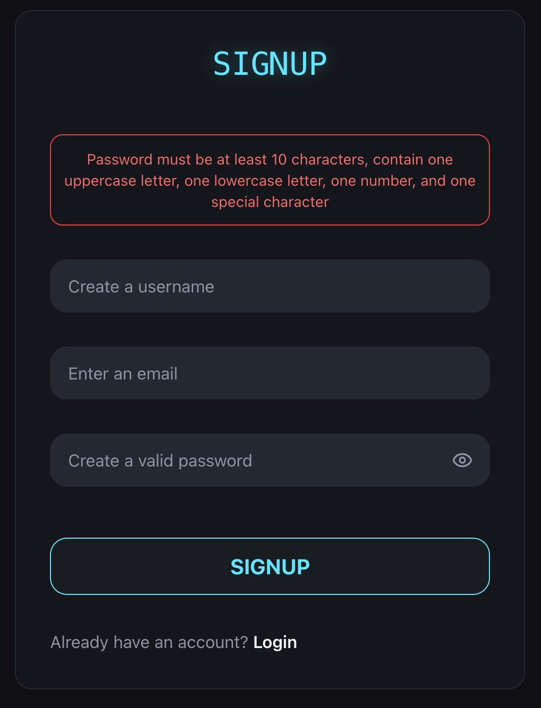
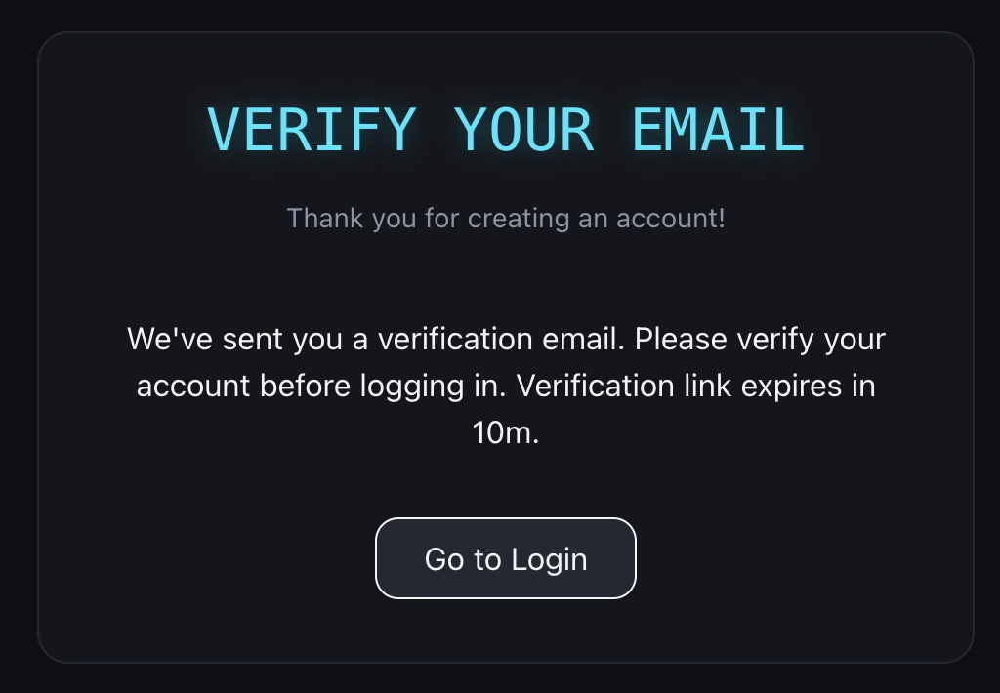

# Zero Scroll

A focused productivity app that helps you get things done without distractions. Built around the Pomodoro technique with task management, analytics, and a drift-proof timer that keeps ticking accurately even when your browser tab isn't active.



## What It Does

Zero Scroll is a focus timer with built-in task tracking and analytics. The idea is simple: pick a task, start the timer, and work without scrolling through social media or getting distracted. Track your progress over time and see when you're most productive.

### Key Features

**Drift-Proof Timer**  
The timer runs in a Web Worker thread, separate from the main UI. This means it keeps accurate time even if your browser is doing heavy work or you switch tabs. This eliminates the possibility of your 25 minute session taking 20 minutes instead.



**Task Management**  
Create tasks, mark them as complete, change their priority (low, medium, or high), edit / delete them, and track what you're actually working on during each focus session. The task list integrates directly with your timer sessions.



**Session Analytics**  
View your focus patterns over time with charts from Recharts library showing:

- Daily focus minutes over the past 7, 14, or 30 days
- Best hours of the day for focused work (3-6pm, 6-9pm, etc)
- Session completion rates (how often you finish, end early, or discard (session is less than 5 mins) sessions)



**Secure Authentication**  
Full user authentication with JWT access tokens and refresh tokens. The app automatically refreshes expired access tokens in the background, so you never get logged out mid-session. Email verification included with resend verification capabilities.

**Audio Integration**  
Built-in audio sliders / controls to help you stay focused (ambient sounds, music, etc.). Automatic bell ring audio on session completion with the ability to disable or allow in user preferences



**Custom Preferences and User Stats**
Custom preferences and settings such as:

- Set daily session completion goal
- Toggle between auto start timer after session end
- Play sound effects on session end



**Different Focus and Break Themes**
The app featues a vibrant, neon blue accent as the primary theme for app and focus sessions. Break and recover session trigger a theme change to a sharp neon green accent to keep the app fresh and rejuvenating.



## Tech Stack

**Frontend (This Repo)**

- React 19 with hooks and context API
- Vite for fast development
- TailwindCSS for styling
- Recharts for analytics visualizations
- Axios with custom interceptors for auth token refresh and attaching access token to protected routes
- Web Workers for the timer logic
- React Router for navigation

**Backend (Separate Repo)**

- RESTful API with JWT authentication
- Refresh token rotation for security
- Session and task persistence

## Project Structure

```
src/
├── components/       # Reusable UI components
│   ├── audio/       # Audio controls
│   ├── charts/      # Recharts visualizations
│   ├── layout/      # Sidebar, navigation, and layout components
│   ├── settings/    # User settings and preferences
│   ├── stats/       # Analytics components
│   ├── tasks/       # Task list and items
│   ├── timer/       # Timer display and controls
│   └── ui/          # Shared UI components (modals, spinners, etc.)
├── context/         # React context providers
├── pages/           # Main app pages
├── services/        # API calls and utilities
└── workers/         # Web Worker for timer
```

## How It Works

### The Timer

The timer uses a Web Worker to run in a separate thread from the React UI. This prevents timer drift that happens when JavaScript execution is blocked by rendering or other tasks.

```javascript
// Worker calculates time based on Date.now() instead of counting ticks
const tick = () => {
  const remainingMS = endTime - Date.now();
  remainingSec = Math.max(0, Math.ceil(remainingMS / 1000));
  // Send update to React component
};
```

When you complete a session, it calculates the actual elapsed time and saves it to your stats. If you end a session early, that's tracked separately.

### Authentication Flow

The app uses a dual-token system:

- **Access tokens** are short-lived, expiring in 15 minutes (stored in memory only)
- **Refresh tokens** are long-lived, expiring in 30 days (HTTP-only cookies)

When an access token expires, Axios interceptors automatically call the refresh endpoint to get a new one, then retry the failed request. You don't even notice it happening.

```javascript
// Axios response interceptor handles 401 errors
if (status === 401 && !originalRequest._retry) {
  // Get new access token
  const { data } = await axios.post('/auth/refresh');
  // Retry original request with new token
  return api(originalRequest);
}
```

## Getting Started

### Prerequisites

- Node.js 18+
- Backend API running (separate repository)

### Installation

1. Clone the repo

```bash
git clone https://github.com/matthewhaines12/zero-scroll.git
cd zero-scroll
```

2. Install dependencies

```bash
npm install
```

3. Create a `.env` file

```env
VITE_API_URL=http://localhost:3001/api
```

4. Start the development server

```bash
npm run dev
```

The app will be running at `http://localhost:5173`

## Environment Variables

| Variable       | Description          |
| -------------- | -------------------- |
| `VITE_API_URL` | Backend API base URL |

### Other Screenshots





### Mobile Responsive

In progress

### Leaderboards

In progress

## Why "Zero Scroll"?

The name comes from the goal: zero scrolling through social media or distractions while you're trying to focus. Just you, your task, and the timer. I highly reccomend anyone who hasn't tried a pomodoro style timer to give it a try.

## Contributing

This is a personal project, but feel free to fork it and make it your own.
